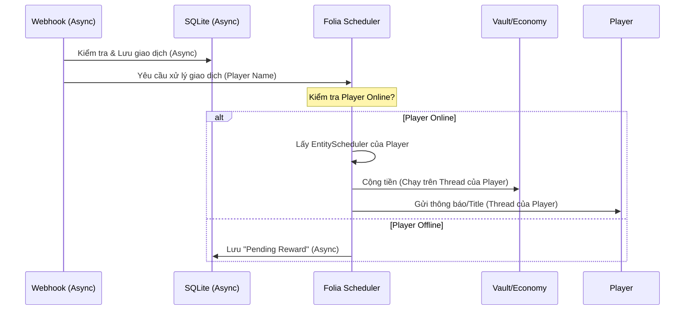

# Thiết kế Mở rộng: Hỗ trợ Folia (Multithreaded Minecraft)

Tài liệu này mô tả chi tiết các thay đổi kiến trúc cần thiết để biến `SepayPlugin` (hiện tại là Paper) thành plugin tương thích hoàn toàn với Folia.

## 1. Kiến trúc Cốt lõi & Thách thức
Folia loại bỏ "Main Thread" duy nhất và thay thế bằng:
- **Region Threads**: Mỗi khu vực (chunk group) chạy trên một thread riêng.
- **Global Region Thread**: Xử lý logic toàn cục (login, command map, scoreboard).
- **Async Threads**: Các tác vụ không đụng vào world/entity (database, network - đã có).

### Thách thức chính
1.  **Scheduler**: `Bukkit.getScheduler()` là deprecated hoặc hoạt động không như ý. Phải dùng `RegionScheduler` hoặc `GlobalRegionScheduler`.
2.  **Command Execution**: Lệnh từ Console chạy trên Global. Lệnh từ Player chạy trên Region của Player.
3.  **Teleport/Respawn**: Cần xử lý bất đồng bộ.
4.  **Map Renderer**: Việc gửi packet Map (QR Code) cần được thực hiện trên thread của người chơi nhận Map.

## 2. Các Thay đổi Cụ thể

### 2.1. Dependency & Build System
Sử dụng `folia-api` thay vì `paper-api` để truy cập các API scheduler mới.

```xml
<dependency>
    <groupId>dev.folia</groupId>
    <artifactId>folia-api</artifactId>
    <version>1.20.1-R0.1-SNAPSHOT</version>
    <scope>provided</scope>
</dependency>
```

### 1.1. Chiến lược Kiến trúc: Single Jar (Khuyên dùng)
Thay vì tách ra 2 plugin riêng biệt (1 cho Paper, 1 cho Folia), ta nên giữ **1 Codebase duy nhất** (Single Jar) vì:
- **Logic giống nhau 90%**: Các tính năng Map, Webhook, QR, Database hoàn toàn giống nhau.
- **Dễ bảo trì**: Chỉ cần sửa bug ở 1 nơi.
- **Abstraction Layer**: Chỉ cần trừu tượng hóa lớp `Scheduler` và `Region Check`.

**Cách thực hiện:**
- Dùng `folia-api` làm thư viện `provided` (chỉ dùng lúc compile).
- Khi plugin load (`onEnable`), kiểm tra xem server có class `io.papermc.paper.threadedregions.RegionizedServer` không.
- Nếu có -> Load `FoliaScheduler`. Nếu không -> Load `PaperScheduler`.

> **Q: Khi build làm sao biết build cho cái nào?**
> **A: Không cần chọn!** Chúng ta build ra **1 file Jar duy nhất** (Universal Jar).
> - File Jar này chứa code xử lý cho cả 2 tụi nó.
> - Khi server chạy nó lên, nó sẽ tự "nhìn" xem server đang chạy là Paper hay Folia để kích hoạt chế độ phù hợp.
> - **Build 1 lần -> Chạy mọi nơi.**

### 2.2. Scheduler Refactoring (Quan trọng nhất)
Tạo một lớp wrapper `TaskUtils` hoặc `Scholar` để trừu tượng hóa việc lập lịch, tự động phát hiện Folia/Paper.

| Tác vụ | Paper (Cũ) | Folia (Mới) |
| :--- | :--- | :--- |
| Chạy tick sau 1s (Global) | `runTaskLater` | `GlobalRegionScheduler.runDelayed` |
| Chạy trên Entity (Player) | `runTask` | `entity.getScheduler().run` |
| Chạy tại Location (Block) | `runTask` | `RegionScheduler.run(loc)` |
| Async Task | `runTaskAsynchronously` | `AsyncScheduler.runNow` |

### 2.3. Quy trình Xử lý Webhook (Thread-Safe)
Luồng xử lý khi Webhook nhận tín hiệu từ Sepay:



**Implementation Code Idea:**
```java
// Khi nhận webhook thành công
Player player = Bukkit.getPlayer(playerName);
if (player != null) {
    // Folia: Lên lịch chạy trên thread quản lý player này
    player.getScheduler().run(plugin, (task) -> {
        vaultHook.depositPlayer(player, amount);
        player.sendMessage("Cộng tiền thành công!");
    }, null);
}
```

### 2.4. Map QR Renderer
`MapCanvas.drawImage` thường an toàn nếu gọi đúng lúc, nhưng việc khởi tạo và gửi MapView cần chú ý:
- `Bukkit.createMap(world)`: Phải gọi trên Main/Region thread của World đó.
- `player.sendMap(mapView)`: Phải gọi trên Entity Thread của Player.

-> **Giải pháp**:
Khi lệnh `/nap` được thực thi:
1.  Lệnh chạy trên Thread của Player (Folia tự lo việc này).
2.  Tính toán QR (Async - để không lag server).
3.  Quay lại Thread Player -> `createMap` -> `render` -> `giveItem`.

### 2.5. Hỗ trợ Hybird (Folia + Paper)
Không nên tách riêng 2 plugin. Sử dụng Reflection hoặc check `Folia.isFolia()` để dùng đúng Scheduler.

```java
public class SchedulerAdapter {
    public void runCurrent(Entity entity, Runnable task) {
        if (isFolia) {
            entity.getScheduler().run(plugin, t -> task.run(), null);
        } else {
            Bukkit.getScheduler().runTask(plugin, task);
        }
    }
}
```

## 3. Kế hoạch triển khai (Checklist)

- [ ] **Phase 1: Core Adaptation**
    - [ ] Cập nhật `pom.xml` thêm Folia API (optional dependency).
    - [ ] Tạo interface `IScheduler` và 2 implementation: `PaperScheduler`, `FoliaScheduler`.
    - [ ] Inject `IScheduler` vào `SepayPlugin`.

- [ ] **Phase 2: Refactor Logic**
    - [ ] Refactor `NapCommand`: Chuyển logic sinh QR sang Async, logic trao Map về Sync (qua IScheduler).
    - [ ] Refactor `WebhookServer`: Khi xử lý phần thưởng, đảm bảo gọi qua `IScheduler.runEntity(player, ...)`.
    - [ ] Refactor `PlayerJoinListener`: Kiểm tra nạp tiền tồn đọng (Pending) trên thread của player khi join.

- [ ] **Phase 3: Testing**
    - [ ] Test trên Paper 1.21 (Regression test).
    - [ ] Test trên Folia 1.20.x/1.21 (Folia test).
    - [ ] Webhook spam test (kiểm tra race condition).

## 4. Rủi ro & Lưu ý
- **Vault Compatibility**: Hầu hết plugin Economy hiện đại đã hỗ trợ Folia, nhưng cần kiểm tra xem bản Vault/Economy plugin (như EssentialsX) đang dùng có hỗ trợ Folia không.
- **Database I/O**: Tuyệt đối không truy cập Database (SQLite) từ Region Thread. Luôn dùng `AsyncScheduler` cho DB.
